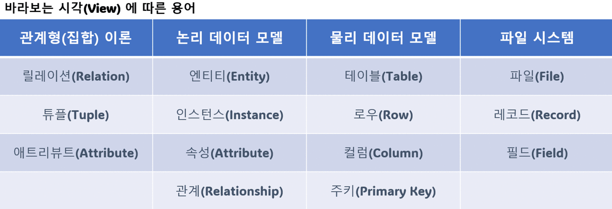

# Ch01 엔티티

2023년 12월 19일 화요일 19시~21시

## 1.1 집합과 엔티티

- 집합(Set)의 정의(by Georg Cantor)
  - "우리의 직관 또는 사고의 대상으로서 확정되어 있고 서로 명확히 구별되는 것들의 모임"
- 원소(Element)
- 식별자(Identifier)
- Relation(속성)
- 인스턴스

### 1.2 엔티티에 대한 서설

- 엔티티의 정의
  - "업무를 수행하는 데 필요한 데이터를 특성이 유사한 것끼리 모아 놓은 집합"
  - 특성이 유사 == 속성(데이터)의 함수 종속(Functional Dependency)

### 1.3 엔티티 정의가 왜 중요한가

- 정의(Definition)
- 선언(Declaration)
- 설명(Explanation)

## 1.4 엔티티 분류법

- 실체(만질 수 있는) / 만질 수 없는(행위, 개념)
- 자립(Indenpedent) / 종속(Existence Dependency) 엔티티
- 원천(Raw) / 가공(Processing) 데이터
- 실체 / 행위/ 가공 / 기준 엔티티
- 내부 생성 데이터(Internal Data) / 외부 생성 데이터(External Data)
- 기본 / 내역 / 상세 엔티티

### 1.5 엔티티 정의 - 보이는 것인가?

- 실체 엔티티: 만질 수 있는 현실세계 상품과 대응
- 만질 수 없는 엔티티: 주문과 같은 행위나, 환율과 같은 개념

### 1.6 엔티티 정의 방법 - 스스로 존재하는가?

- 자립 엔티티: Independent, Strong, Dominant
- 종속 엔티티: Dependent, Weak, Subordinate, 부모가 반드시 필요
- 참조 관계(Referential Relationship) 가 있다고 종속은 아니다. (직업-<고객)

#### 1.7 종속 엔티티의 종류

- 부모 엔티티의 부가 데이터를 관리하는 엔티티
- 1정규화에 의해 발생한 엔티티
- 이력 데이터를 관리하는 엔티티
- 다대다 관계에서 발생한 교차 엔티티
- 슈퍼타입에 대한 서브타입 엔티티
- 엔티티 분해에 의한 일대일 관계의 엔티티

#### 1.8 모델(ERD)과 메타 시스템의 속성 설명

메타 시스템의 속성 엔티티(메타 데이터)는 종속 엔티티이다.

### 1.9 엔티티 정의 방법 - 원천 데이터인가?

- 원천: 입력(Key-In)
  - 참조 무결성(RI, Referential Integrity)
  - 정규화 철저히
  - 식별자가 업무 식별자(Business Identifier)가 된다.
- 가공
  - 실체화된 뷰(Materialied View)
  - 원천 엔티티가 바뀌면 가공 엔티티도 수정해야함(Eventual Consistency)

### 1.10 데이터 본질에 따른 엔티티 분류법 - 실체/행위/가공/기준

#### 1.11 실체 엔티티란?

실제 물체에 대한 데이터를 관리하는 엔티티

- 주 식별자는 단순하게
- 과감한 통합 필요
- 이력 데이터 주의해서 설계

#### 1.12 행위 엔티티란?

행위나 활동으로 발생한 원천 데이터를 관리하는 엔티티

- 엔티티 발생 순서 존재
- 주 식별자가 복잡
- 업무 식별자를 사용(육하원칙, who/what/when/where/how)

#### 1.13 가공 엔티티란?

원천 데이터를 추출 집계한 데이터를 관리하는 엔티티

- 집계 기준(Dimension) 역할을 하는 엔티티 이외의 엔티티와는 관계가 존재하지 않음
- 주 식별자는 집게 기준을 의미
- 통합을 해야 데이터 중복으로 인한 정합성 문제가 생기지 않음

#### 1.14 기준 엔티티란

실체,행위 엔티티의 기준이 되는 데이터를 관리하는 엔티티(코드)

- 기준 정보 성격(코드 데이터)
- 기본 정보 성격(과목 데이터)
- 통합이 중요: 하나만 존재, 구조가 통합됨

### 1.15 엔티티 정의 방법 - 데이터 생성에 따른 분류법

- 내부 데이터(Internal Data)
  - 검증 가능
- 외부 데이터(External Data)
  - 검증 불가능
  - 입력(Key-In), 배치(Batch)
  - 외부에서 입력받은 원본을 보존하고, 파싱을 해야 한다.

### 1.16 엔티티 정의 방법 - 엔티티 유형에 따른 분류법

- 기본 엔티티 == 실체 엔티티
- 내역 엔티티 ~~ 행위 엔티티
- 상세 엔티티 : 두 개의 엔티티로 분해할 때의 하위 엔티티
- 이력 엔티티
- 코드 엔티티
- 관계 엔티티
- 집계 엔티티
- 백업 엔티티
- 임시 엔티티 : 사용한 후 삭제하는 엔티티

### 1.17 교차 엔티티란?

다대다 관계에서 필요한 엔티티

## 1.18 엔티티 설계 원칙

- 데이터 정체성 : 뭐하는 엔티티인지 잘 정의해야함
- 엔티티 무결성 : 주 식별자가 존재해야함
- 엔티티 유일성 : 같은 성격의 엔티티는 전사적으로 유일해야함
- 데이터 혼용배제 : 하나의 엔티티에 다른 성격의 데이터를 혼용하면 안됨
- 타 엔티티와 관계 존재 : 아무 관계가 없는 엔티티는 뭔가 잘못됨
- 프로세스 도출 지양 : 프로세스와 엔티티는 별개다
- 화면 도출 지양 : 화면과 엔티티는 별개다
- 데이터 관리 요건 : 데이터베이스로 관리 가능해야함

## 1.19 엔티티 명은 어떻게 정하는가?

집합의 Determinant(결정자)를 우선 고민하는게 좋음

FD: Determinant -> Dependent  
Dependent = f(Determinant)

- 데이터 성격을 파악하기 쉽게
- 일관성 있게
- 구체적으로
- 확장성을 고려하여
- 필요한 단어로만
- 프로세스를 표현하지 않도록
- 명사형으로
- 가능하면 짧게
- 테이블 명이 엔티티 명에 종속되지 않도록
- 동일한 엔티티 명이 없도록

### 1.20 다양한 엔티티에 대한 명명법

- 실체 엔티티: 명사로 끝나기
- 행위 엔티티: 명사로 끝나지 않기
- 교차 엔티티: 관계를 명명
- 집계 엔티티: 집계 기준(Dimension)으로
- 외부 엔티티: 외부 기관명을 포함
- 서브타입 엔티티: 슈퍼타입 엔티티에 수식어를 붙여서
- 일대일 관계 엔티티: ~상세, ~요청, ~승인

## 1.21 엔티티 설명은 어떻게 기술하는가?

- 설명보다 잘못된 엔티티명과 업무 식별자로 혼란 초래
- 본질적인 설명과 부가 설명

## 1.22 개념 모델에 포함하는 주요 엔티티란?

- 핵심 엔티티(Primary Entity)를 개념 모델에 포함시켜야 한다.
- 행위의 주체가 되는 엔티티가 주요 엔티티
- 개념 모델링을 하기 위해 필요

### 1.23 엔티티 정의의 또 다른 이름 - 업무 식별자

업무 식별자를 찾는게 곧 엔티티의 정의다.

#### 1.24 업무 식별자 도출 방법

집합의 결정자(Determinant) 를 찾아내야함

#### 1.25 업무 식별자 표현 방법

Super Identifier(최소한의 속성)

- 실체 엔티티: 식별 번호
- 행위 엔티티: 육하원칙(Who, What, When, How)
- 집계 엔티티: 집계 기준(Dimension)
- 이력 엔티티: 시간 개념 포함

대리 식별자(Alternate Identifier, AK): seq 말고 unique 한 속성조합을 임시로 사용  
후보 식별자(Candidate Key)  
업무 식별자(Business Key)  
BK 외에 AK 나 CK 가 존재할 때는 설명으로 기술해야한다.

## 1.26 데이터 모델을 검증할 수 있는가?

### 1.27 엔티티 검증

Data Model Review  

### 1.28 데이터 모델 설계 원칙

- 데이터 무결성
- 데이터 성능
- 관리 효율성
- 사용 편의성

### 1.29 무결성(Integrity)에 대해서

- Data Integrity: Anomaly 가 발생하지 않은 상태
  - Entity Integrity: Unique, Not NULL
  - Referential Integrity, 참조 엔티티의 주 식별자 or NULL
  - Domain Integrity : 비즈니스 로직이 지켜짐
  - Business Integrity : 트리거

### 1.30 성능에 대해서

- 조회 성능 (SELECT)
- 쓰기 성능 (INSERT, UPDATE, DELETE)
- OLTP(OnLine Transaction Process)
- 비정규화, 중복 데이터를 사용하면 조회 성능이 향상되지만, 반대로 쓰기 성능은 저하된다.
